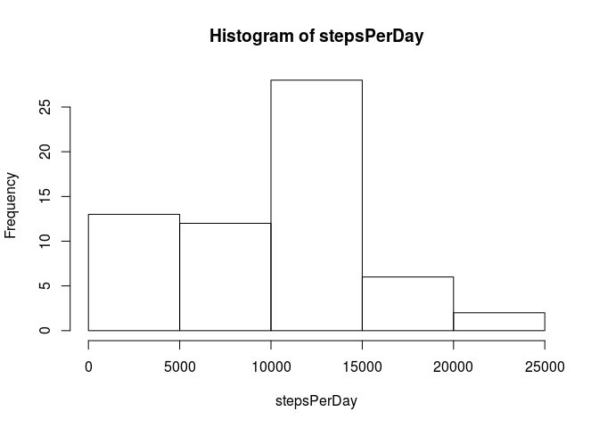
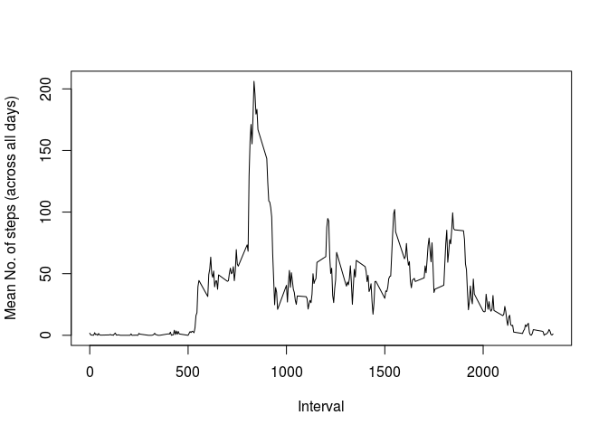
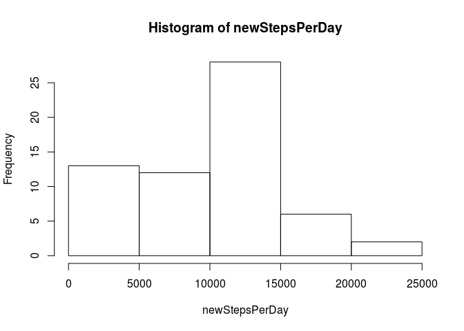
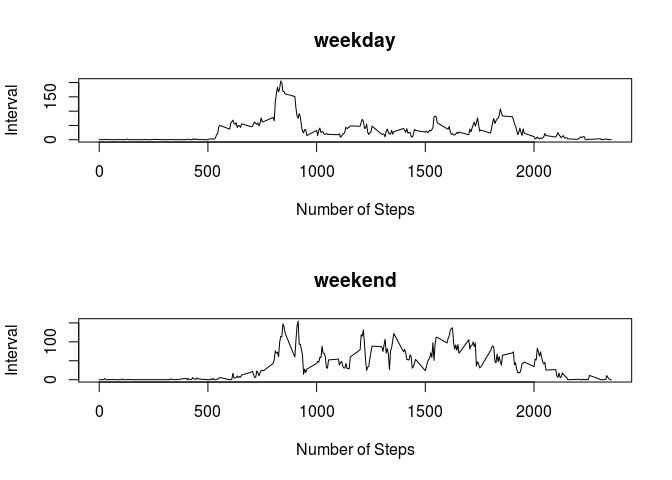

# Reproducible Research: Peer Assessment 1


## Loading and preprocessing the data
We begin by loading the data.


```r
setwd("/home/alexgmcm/Dropbox/coursera/R/repres/RepData_PeerAssessment1")
activityData<-read.csv("activity.csv")
```


## What is mean total number of steps taken per day?

Ignoring missing values.


```r
#Calculate the number of steps in a day.
stepsPerDay<-tapply(activityData$steps,activityData$date,sum,na.rm=TRUE)
#Plot histogram
hist(stepsPerDay)
```

 

```r
#Report median and mean.
medianSteps<- median(stepsPerDay,na.rm=TRUE)
meanSteps<-mean(stepsPerDay,na.rm=TRUE)
sprintf("The median is %f", medianSteps)
```

```
## [1] "The median is 10395.000000"
```

```r
sprintf("The mean is %f", meanSteps)
```

```
## [1] "The mean is 9354.229508"
```


## What is the average daily activity pattern?
Again ignoring missing values.

```r
meanInterval<-tapply(activityData$steps,activityData$interval,mean,na.rm=TRUE)
plot(names(meanInterval),meanInterval,type="l",ylab="Mean No. of steps (across all days)",xlab="Interval")
```

 

```r
maxInterval<-names(meanInterval)[[match(max(meanInterval),meanInterval)]]
sprintf("The 5-minute interval which, on average across all the days in the dataset, contains the maximum number of steps is %s", maxInterval)
```

```
## [1] "The 5-minute interval which, on average across all the days in the dataset, contains the maximum number of steps is 835"
```


## Imputing missing values


```r
num_NA<-sum(is.na(activityData))
sprintf("The number of missing values in the dataset is %d", num_NA)
```

```
## [1] "The number of missing values in the dataset is 2304"
```

Now we must decide how to infer the missing values - to decide whether to use the median of the value for the day, or the median of the value for the interval I will compare the standard deviations for the days and and the standard deviations for the intervals to see which is lower on average (using the median as the measure of central tendency) as this means the values are more consistent and thus should yield a more accurate estimate of the missing value.


```r
medianIntervalSD<-median(tapply(activityData$steps,activityData$interval,sd,na.rm=TRUE))
medianDaySD<-median(tapply(activityData$steps,activityData$date,sd,na.rm=TRUE),na.rm=TRUE)
#we need na.rm=TRUE on the medianDaySD because some days have no steps data at all
sprintf("The median standard deviation of steps over the intervals is %f", medianIntervalSD)
```

```
## [1] "The median standard deviation of steps over the intervals is 90.764361"
```

```r
sprintf("The median standard deviation of steps over the days is %f",medianDaySD)
```

```
## [1] "The median standard deviation of steps over the days is 113.627084"
```

Therefore we can see that it makes sense to infer the missing data using the median for the interval.


```r
medianInterval<-tapply(activityData$steps,activityData$interval,median,na.rm=TRUE)
stepsWithNA<-is.na(activityData$steps)
medianIntervalVals<-rep(medianInterval,length.out=length(stepsWithNA))
replacementVals<-stepsWithNA*medianIntervalVals #elem-wise multiplication with logical
newData<-activityData
newData$steps[stepsWithNA]<- replacementVals[stepsWithNA]
newStepsPerDay<-tapply(newData$steps,newData$date,sum)
hist(newStepsPerDay)
```

 

```r
newMedianSteps<-median(newStepsPerDay)
newMeanSteps<-mean(newStepsPerDay)
sprintf("The new median is %f", newMedianSteps)
```

```
## [1] "The new median is 10395.000000"
```

```r
sprintf("The new mean is %f", newMeanSteps)
```

```
## [1] "The new mean is 9503.868852"
```

The median remains the same, the mean has slightly increased - this is to be expected as the values were inferred using the median value for the interval so it is similar to adding more of the median values. Thus the median would remain unchanged but the mean would increase slightly as the original median was larger than the original mean.


## Are there differences in activity patterns between weekdays and weekends?


```r
isWeekend<-function(day){
  if (day == "Saturday" | day =="Sunday"){
    return(1)
  }
  else {return(0)}
}
weekends<-lapply(weekdays(as.Date(newData$date)),isWeekend)
weekends<-unlist(weekends)
weekendFactors<-factor(weekends,labels=c("weekday","weekend"))

newMeanInterval<-tapply(newData$steps,list(newData$interval,weekendFactors),mean)
par(mfrow=c(2,1))
plot(rownames(newMeanInterval),newMeanInterval[,"weekday"],type="l",main="weekday",xlab="Number of Steps",ylab="Interval")
plot(rownames(newMeanInterval),newMeanInterval[,"weekend"],type="l",main="weekend",xlab="Number of Steps",ylab="Interval")
```

 
